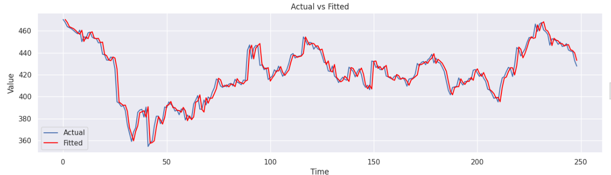

# ARIMA-Stock-Price-Forecasting 📈

This repository contains a Google Colab notebook that demonstrates the process of building an ARIMA (Autoregressive Integrated Moving Average) model for stock price forecasting. The notebook focuses on the methodology for choosing the `(p, d, q)` parameters, using Microsoft (MSFT) stock data as a case study.

## 🎯 Project Objective

The main goal of this notebook is not just to build a forecasting model, but to guide the user through the critical steps of time series analysis to determine the correct parameters for an ARIMA model.

## 📊 Final Forecast: Actual vs. Predicted

The chart below shows the result of the trained ARIMA model, comparing the predicted values (orange line) with the actual values from the test set (blue line). The shaded area represents the 95% confidence interval of the forecast.


> *This image is generated by the notebook. To recreate it, run all the cells.*

## ✨ Notebook Contents

The notebook is divided into the following sections:

1.  **⚙️ Environment Setup**: Installs the necessary libraries (`pmdarima`, `numpy`) and imports all required packages.
2.  **🧹 Data Loading and Cleaning**:
    *   Reads the `MSFT-1Y-Hourly.csv` dataset.
    *   Cleans the `Close/Last` price column by removing the `$` character and converting it to a numeric type.
3.  **📊 Stationarity Analysis (The 'd' Parameter)**:
    *   Checks for stationarity using the Augmented Dickey-Fuller (ADF) Test.
    *   Visualizes the Autocorrelation Function (ACF) to confirm non-stationarity.
    *   Applies differencing to make the series stationary and determines the value of `d`.
4.  **🔍 Determining the 'p' Parameter (Autoregressive Order)**:
    *   Analyzes the Partial Autocorrelation Function (PACF) of the differenced series to identify the number of AR terms.
5.  **🔍 Determining the 'q' Parameter (Moving Average Order)**:
    *   Analyzes the Autocorrelation Function (ACF) of the differenced series to identify the number of MA terms.
6.  **🏋️‍♀️ ARIMA Model Training**:
    *   Fits an ARIMA model with the `(p, d, q)` parameters identified in the analysis.
    *   Analyzes the model summary and residuals.
7.  **🔮 Forecasting and Evaluation**:
    *   Splits the data into training (80%) and testing (20%) sets.
    *   Trains the model on the training set.
    *   Generates forecasts for the test set period.
    *   Visualizes the forecast against the actual values, including the confidence interval.

## 🚀 How to Run

The easiest way to get started is to open the notebook directly in Google Colab.

1.  **Click the button below to open the notebook.**
    
    [
    > **Note:** Remember to replace `YOUR_USERNAME` with your actual GitHub username in the link if you are forking this repo.

2.  **Save a copy to your Google Drive.**
    Once the notebook is open, save your own copy by navigating to `File > Save a copy in Drive`. This will allow you to run, edit, and save your changes.

3.  **Upload the dataset.**
    In the Colab left sidebar of your new notebook, click the "Files" icon. Click "Upload to session storage" and select the `MSFT-1Y-Hourly.csv` file from this repository.

4.  **Run the cells.**
    Execute the notebook cells in sequential order.
    *   **Important**: The first cell contains `exit()`, which will force the Colab kernel to restart. This is intentional to load the correct library versions. After it restarts, continue running the cells from the top.

## 📂 File Structure

```
.
├── ARIMA.ipynb               # The main notebook with all the analysis
├── MSFT-1Y-Hourly.csv        # The dataset used for the analysis
├── forecast_plot.png         # The output plot showing the forecast vs. actual values
└── README.md                 # This descriptive file
```

## 📦 Dependencies

The main libraries used in this project are:

*   `pandas`
*   `numpy==1.26.4`
*   `matplotlib`
*   `seaborn`
*   `statsmodels`
*   `pmdarima`

The first cell in the notebook handles the installation of `pmdarima` and the specific version of `numpy`.

---

Inspired by the YouTube tutorial: [ARIMA Models for Stock Price Prediction](https://www.youtube.com/watch?v=gqryqIlvEoM)
